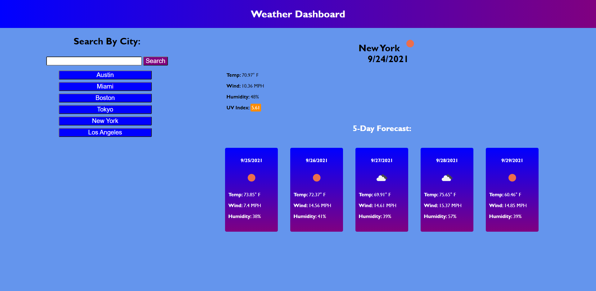

# Weather Dashboard

## Table of Contents
* [Deployed](#deployed)
* [Description](#description)
* [Technologies](#technologies)
* [Usage](#usage)
* [Preview](#preview)
* [Questions](#questions)
* [Credits](#credits)

## Deployed
https://sarawrmas.github.io/weather-dashboard/

## Description
If you're making travel plans and want to compare weather patterns in various cities, Weather Dashboard is the tool for you. Search weather data by city and your searches will be saved to a list that can be re-accessed with the click of a button.

## Technologies
* HTML
* CSS
* JavaScript

## Usage
Use the search bar on the left to find the weather in any city and hit the "Search" button.

To the right of the search bar, the city's name and current weather report as well as today's date will appear. Today's forecast shows the current temparature, wind speed, humidity, and UV Index. If the UV index is favorable, it will appear in green. Moderate UV index will display orange, and unfavorable index will display red.

The 5-Day Forecast section shows weather predictions for the next 5 days for the given city in a card format with the date, an icon representing expected weather patterns, the temperature, wind, and humidity.

After searching for a city, it will appear in a list under the search bar. If you click on one of your previous searches, the weather data for that city will repopulate in the body.

## Preview

## Questions
Have questions about this project?
GitHub: https://github.com/sarawrmas
Email: sara.m.adamski@gmail.com

## Credits
Sara Adamski  
Open Weather API: https://openweathermap.org/api